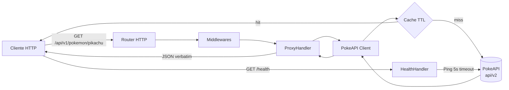
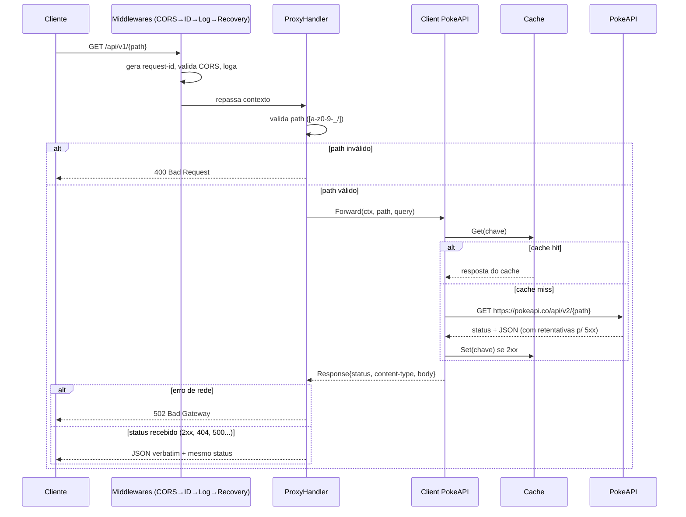
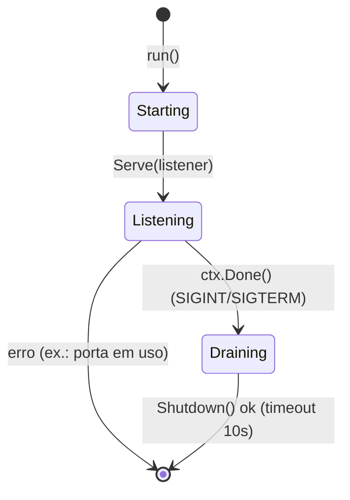

# CHANGELOG — pokedex-api

> Documentação humana do projeto. Contém visão geral, arquitetura, endpoints,
> configuração, setup, execução, testes e exemplos. Para o diário de bordo do
> agente (decisões técnicas e gotchas), consulte o `SUMMARY.md`.

---

## 1. O que é este projeto

API proxy escrita em **Go** que consome a [PokeAPI](https://pokeapi.co/docs/v2) e
**processa os JSONs recebidos com structs Go e os serializa novamente**. Inclui:

- **Proxy pass-through** de qualquer recurso da PokeAPI (`/api/v1/{resource}/{id}`).
- **Modelos Go didáticos**: respostas JSON são desserializadas em structs (com schema
  explícito para `Pokemon`, `Berry` e `Item`) e serializadas novamente antes de serem devolvidas.
- **Endpoint de health check** (`/health`) com verificação da dependência externa.
- **Documentação OpenAPI 3.0** servida em `/docs/openapi.json` + **Swagger UI** em `/docs`.
- **Cache em memória** com TTL, **retentativas** em falhas 5xx e **graceful shutdown**.
- **+90% de cobertura de testes** (atualmente **96.3%**), comentado linha a linha em PT-BR.

**Stack**: Go 1.26 — **zero dependências externas** (stdlib pura).

---

## 2. Arquitetura



### Fluxo de uma requisição de proxy



### Ciclo de vida do servidor



---

## 3. Endpoints

| Método | Rota | Descrição | Respostas |
|---|---|---|---|
| GET | `/health` | Health check do serviço e da PokeAPI | `200` ok / `503` degraded |
| GET | `/api/v1/{resource}/{id}` | Proxy pass-through de recurso da PokeAPI | `200` recurso, `400` path inválido, `404` não encontrado (repassado), `502` falha de rede |
| GET | `/docs` | Interface Swagger UI interativa | `200` HTML |
| GET | `/docs/openapi.json` | Especificação OpenAPI 3.0 em JSON | `200` JSON |
| GET | `/` | Índice da API (nome, versão, endpoints) | `200` JSON |

> `{resource}` e `{id}` podem ser nomes ou IDs numéricos da PokeAPI:
> `pokemon/pikachu`, `pokemon/1`, `berry/cheri`, `location/1`, `item/potion`, listagens com `?limit=&offset=`.

### Exemplo do `/health`

```json
{
  "status": "ok",
  "version": "1.1.0",
  "uptime_seconds": 42,
  "dependencies": { "pokeapi": "ok" },
  "timestamp": "2026-08-01T01:00:00Z"
}
```

---

## 4. Configuração (variáveis de ambiente)

| Variável | Padrão | Descrição |
|---|---|---|
| `PORT` | `8080` | Porta de escuta do servidor HTTP |
| `POKEAPI_BASE_URL` | `https://pokeapi.co/api/v2` | URL base da API externa |
| `REQUEST_TIMEOUT_MS` | `10000` | Timeout (ms) de cada requisição externa |
| `CACHE_ENABLED` | `true` | Liga/desliga o cache em memória |
| `CACHE_TTL_SECONDS` | `60` | Tempo de vida das entradas do cache |
| `CACHE_MAX_ENTRIES` | `512` | Limite de entradas do cache |
| `MAX_RETRIES` | `1` | Tentativas extras em falhas 5xx/de rede |
| `LOG_LEVEL` | `INFO` | Nível de log (`DEBUG`, `INFO`, `WARN`, `ERROR`) |
| `LOG_FORMAT` | `json` | Formato (`json` ou `text`) |
| `CORS_ALLOWED_ORIGIN` | `*` | Origem permitida no CORS |
| `VERSION` | `1.1.0` | Versão exposta no `/health` e índice |

---

## 5. Setup e execução

### Pré-requisitos
- **Go 1.22+** (projeto testado com Go 1.26.4). Download: https://go.dev/dl/

### Passo a passo
```bash
# 1. Clone/entre na pasta do projeto
cd pokedex-api

# 2. (Opcional) compile o binário
make build

# 3. Rode o servidor (porta 8080 por padrão)
make run
# ou com variáveis customizadas:
PORT=9090 CACHE_TTL_SECONDS=30 LOG_FORMAT=text go run ./cmd/api
```

### Smoke test rápido
```bash
# Health check
curl http://localhost:8080/health

# Proxy: dados do Pikachu
curl http://localhost:8080/api/v1/pokemon/pikachu
curl http://localhost:8080/api/v1/pokemon/25

# Proxy: listagem paginada
curl "http://localhost:8080/api/v1/pokemon?limit=5&offset=10"

# Documentação Swagger UI (abra no navegador)
open http://localhost:8080/docs
```

### Encerramento
- `Ctrl+C` (SIGINT) ou `kill <pid>` (SIGTERM) → **graceful shutdown** (drena conexões, timeout 10s).

---

## 6. Testes e qualidade

```bash
make test           # roda todos os testes
make coverage       # testes + falha se cobertura total < 90%
make coverage-html  # gera coverage.html para visualização no navegador
make test-race      # testes com detector de corrida (race)
make vet            # go vet (lint estático)
make fmt-check      # verifica formatação gofmt
make check          # tudo acima de uma vez
```

### Cobertura atual

| Pacote | Cobertura |
|---|---|
| internal/config | 100.0% |
| internal/httpserver | 98.9% |
| internal/pokeapi | 95.6% |
| internal/server | 93.1% |
| cmd/api | 83.3%* |
| internal/docs | 75.0%** |
| **Total** | **96.3%** |

\* `main()` contém apenas `os.Exit` e não é unit-testável (convenção Go: entry point enxuto).
\*\* Pacote de embed (`//go:embed`); o branch de erro de `SpecVersion` não é exercitável com o arquivo embutido sempre válido.

Os testes cobrem: validação de configuração (100%), cliente proxy (sucesso, query,
404 repassado, erro de rede, cancelamento de contexto, retentativas, cache hit/miss),
cache (TTL, eviction, concorrência), handlers (proxy, índice, docs), health (ok/degraded),
middlewares (request-id, logging, recovery, CORS), router (todas as rotas, 404, 405) e o
ciclo de vida completo do servidor (subida, requisições reais e desligamento gracioso).

---

## 7. Estrutura do projeto

```
pokedex-api/
├── Makefile                     # Alvos de build/run/test/coverage/lint
├── scripts/
│   └── check-coverage.sh        # Falha se cobertura < limite (padrão 90%)
├── cmd/
│   └── api/
│       ├── main.go              # Entry point (enxuto) + newLogger
│       └── main_test.go         # Testes do main (inclui ciclo de vida via SIGTERM)
└── internal/
    ├── config/
    │   ├── config.go            # Env vars + defaults + validação
    │   └── config_test.go
    ├── pokeapi/
    │   ├── client.go            # Cliente HTTP (Forward/Ping) + retentativas
    │   ├── cache.go             # Cache TTL thread-safe
    │   └── *_test.go            # Testes do cliente e do cache
    ├── httpserver/
    │   ├── router.go            # ServeMux Go 1.22 + middlewares
    │   ├── handlers.go          # Índice, proxy, docs + helpers JSON
    │   ├── health.go            # Handler de health check
    │   ├── middleware.go        # CORS, request-ID, logging, recovery
    │   └── *_test.go            # Testes de router/handlers/health/middleware
    ├── server/
    │   ├── server.go            # Composição + graceful shutdown
    │   └── server_test.go
    └── docs/
        ├── docs.go              # //go:embed dos arquivos de doc
        ├── openapi.json         # Especificação OpenAPI 3.0.3
        ├── index.html           # Swagger UI
        └── docs_test.go
```

---

## 8. Decisões de design (resumo humano)

| Decisão | Escolha | Por quê |
|---|---|---|
| Dependências | **Stdlib apenas** | Build offline, sem supply-chain, previsível |
| Roteamento | `ServeMux` Go 1.22 (`{path...}`, `{$}`) | Nativo, sem lib externa |
| Erros da PokeAPI | **Repassados verbatim** (404 → 404, 500 → 500) | Proxy transparente |
| Falha de rede | **502 Bad Gateway** | Erros de infra não são do recurso |
| Cache | Em memória, TTL, thread-safe, chave = path+query, limpeza lazy de expirados | Reduz chamadas à PokeAPI |
| Retentativas | Backoff exponencial com jitter (base 100ms, teto 2s) | Evita "ondas" sincronizadas em falhas 5xx |
| Health | Deep check da PokeAPI (200 ok / 503 degraded) | Alerta real da dependência |
| Logs | `slog` estruturado em JSON com `X-Request-ID` | Observabilidade e correlação |
| Shutdown | Gracioso com timeout de 10s | Não derruba requisições em voo |
| Paths inseguros | 400 (validação) + limpeza nativa do net/http (307) | Defesa em profundidade |

---

## 9. Limitações conhecidas

- O cache é **por instância** (em memória) — múltiplas instâncias não compartilham.
- Não há autenticação, rate limit por cliente nem persistência.
- A PokeAPI pública sofre limites de uso; o cache ajuda a reduzir a carga.
- `//go:embed` exige que `openapi.json` e `index.html` estejam dentro de `internal/docs/`.
- `CORS_ALLOWED_ORIGIN` tem padrão `*` (permissivo) — em produção, defina origens específicas.

---

## 10. Auditoria de código

O projeto foi auditado por um agente de código ("Configuração de Auditoria de Código").
Resultado da revisão e das correções aplicadas:

| Severidade | Achado | Situação |
|---|---|---|
| Alta | CORS padrão `*` é permissivo em produção | Aceito — configurável via `CORS_ALLOWED_ORIGIN`; produção deve fixar origem |
| Média | Backoff linear → exponencial com jitter | **Corrigido** na v1.1.0 |
| Média | Entradas expiradas acumulavam no cache | **Corrigido** na v1.1.0 (remoção lazy no `Get`) |
| Baixa | Sem log de cache miss | **Corrigido** na v1.1.0 |
| Baixa | `validResourcePath` rejeita chars fora de `a-z` | Aceito — recursos da PokeAPI usam lowercase; validação é defesa em profundidade |

Detalhes técnicos das decisões no `SUMMARY.md` (D12–D14).

---

## 11. Histórico de versões

| Versão | Data | Mudanças |
|---|---|---|
| 1.1.0 | 2026-08-01 | Auditoria de código: backoff exponencial com jitter nas retentativas, remoção lazy de entradas expiradas no cache, log de cache miss, cobertura total 96.3%. |
| 1.0.0 | 2026-08-01 | Versão inicial: proxy pass-through, `/health`, OpenAPI/Swagger, cache TTL, retentativas, graceful shutdown, >90% de cobertura. |
